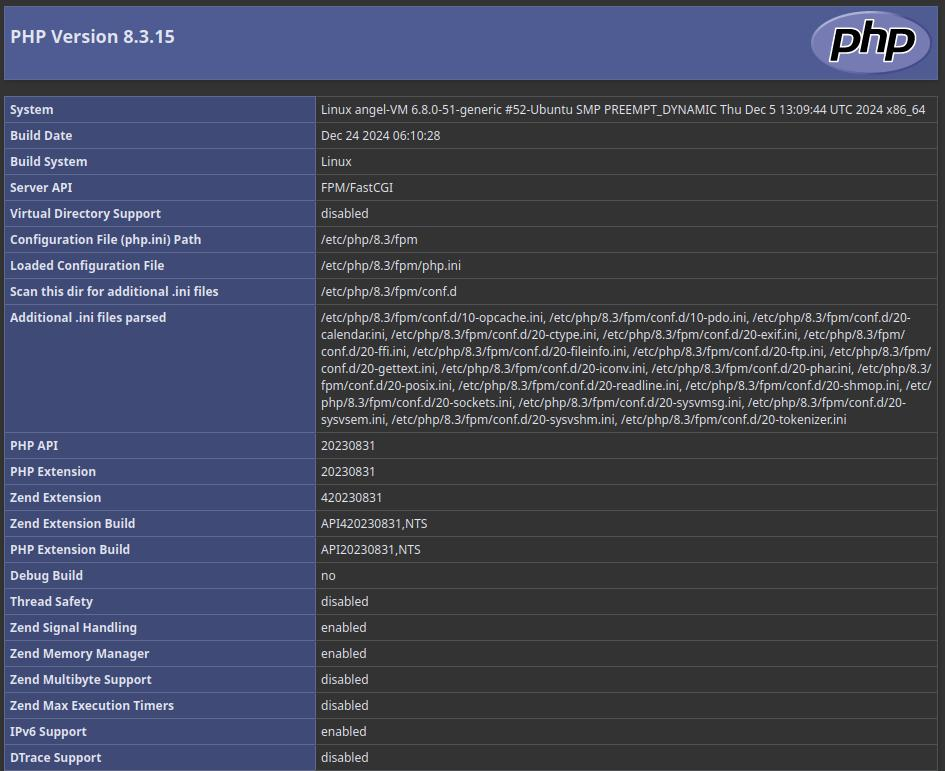

# Actualización e Instalación de Apache, MariaDB y PHP 8.3

Este README.md documenta los pasos seguidos para instalar Apache, MariaDB y PHP 8.3 en un servidor Ubuntu, incluyendo capturas de pantalla y explicaciones necesarias.

## 1. Actualización de repositorios y paquetes

```bash
sudo apt update
sudo apt upgrade
```

---

## 2. Instalación del servidor Apache

```bash
sudo apt install apache2
sudo systemctl start apache2
sudo systemctl enable apache2
```

Para verificar que Apache se ejecuta correctamente, abre tu navegador y accede a `http://dirección-ip`.

---

## 3. Instalación del servidor de base de datos MariaDB

### Instalación
```bash
sudo apt install mariadb-server mariadb-client
sudo systemctl start mariadb
sudo systemctl enable mariadb
```

### Verificación del estado del servidor
```bash
sudo systemctl status mariadb
```

### Verificación de la versión
```bash
mariadb --version
```

### Script de configuración de seguridad
```bash
sudo mysql_secure_installation
```

1. Pulsa `Enter` si no hay contraseña configurada.
2. Establece una nueva contraseña para el usuario `root`.
3. Responde `Y` a las preguntas para mejorar la seguridad.

**Captura de pantalla:** Incluye las capturas del proceso.

---

### Configuración del acceso con la nueva contraseña

Por defecto, MariaDB usa `unix_socket` para autenticar al usuario. Esto significa que no es necesario escribir una contraseña al usar `sudo` y ejecutar comandos de MariaDB desde el terminal.

Para acceder a MariaDB con la nueva contraseña:

```bash
mysql -u root -p
```

**Captura de pantalla:** Incluye el acceso exitoso.

---

### Creación de un nuevo usuario

```sql
CREATE USER 'developer'@'localhost' IDENTIFIED BY '5t6y7u8i';
GRANT ALL PRIVILEGES ON *.* TO 'developer'@'localhost' WITH GRANT OPTION;
FLUSH PRIVILEGES;
```

Prueba el acceso con el nuevo usuario:
```bash
mysql -u developer -p
```

**Captura de pantalla:** Incluye las capturas de creación y acceso.

---

## 4. Instalación de PHP 8.3

### Instalación de PHP 8.3 y módulos
```bash
sudo apt install software-properties-common
sudo add-apt-repository ppa:ondrej/php
sudo apt update
sudo apt install php8.3 libapache2-mod-php8.3 php8.3-mysql php8.3-cli php8.3-common php8.3-json php8.3-opcache php8.3-readline
```

### Habilitar módulo PHP 8.3 en Apache
```bash
sudo a2enmod php8.3
sudo systemctl restart apache2
```

### Verificación de la versión
```bash
php --version
```

### Prueba de PHP con Apache
Crea un archivo `info.php` en el directorio raíz de Apache:
```bash
sudo vim /var/www/html/info.php
```

Contenido del archivo:
```php
<?php phpinfo(); ?>
```

Abre en el navegador: `http://dirección-ip/info.php`.

**Captura de pantalla:** Incluye la salida de `phpinfo()`.

---

## 4.1 Ejecución de PHP con PHP-FPM

### Deshabilitar módulo PHP
```bash
sudo a2dismod php8.3
```

### Instalar PHP-FPM
```bash
sudo apt install php8.3-fpm
```

### Configuración en Apache
```bash
sudo a2enmod proxy_fcgi setenvif
sudo a2enconf php8.3-fpm
sudo systemctl restart apache2
```

Actualiza la página `info.php` y verifica que la API ha cambiado a `FPM/FastCGI`.

**Captura de pantalla:** Incluye el cambio en la salida de `phpinfo()`.


